# 清华大学电子系通信原理实验：基于PCM和Hamming编码的FSK调制通信系统

<center> 李铠峰 袁振钊 王治</center> 

<br>

- [清华大学电子系通信原理实验：基于PCM和Hamming编码的FSK调制通信系统](#清华大学电子系通信原理实验基于pcm和hamming编码的fsk调制通信系统)
  - [一、实验原理](#一实验原理)
  - [二、设计框图](#二设计框图)
  - [三、各部分的具体实现方法](#三各部分的具体实现方法)
    - [**1、Top——主连接模块**](#1top主连接模块)
      - [模块功能：](#模块功能)
      - [实现原理：](#实现原理)
    - [**2、FreDivisions——分频模块**](#2fredivisions分频模块)
      - [模块功能：](#模块功能-1)
      - [实现原理：](#实现原理-1)
    - [**3、Multi\_fredivision——分频模块**](#3multi_fredivision分频模块)
      - [模块功能：](#模块功能-2)
      - [实现原理：](#实现原理-2)
    - [**4、create\_data——信号产生模块**](#4create_data信号产生模块)
      - [模块功能：](#模块功能-3)
      - [实现原理：](#实现原理-3)
    - [**5、PCM\_encode——PCM编码模块**](#5pcm_encodepcm编码模块)
      - [模块功能：](#模块功能-4)
      - [实现原理：](#实现原理-4)
    - [**6、Ham\_encode——hamming编码模块**](#6ham_encodehamming编码模块)
      - [模块功能：](#模块功能-5)
      - [实现原理：](#实现原理-5)
    - [**7、FSK\_modulate——FSK调制模块**](#7fsk_modulatefsk调制模块)
      - [模块功能：](#模块功能-6)
      - [实现原理：](#实现原理-6)
    - [**8、信道**](#8信道)
      - [模块功能：](#模块功能-7)
    - [**9、FSK\_demodulate——FSK解调模块**](#9fsk_demodulatefsk解调模块)
      - [模块功能：](#模块功能-8)
      - [实现原理：](#实现原理-7)
    - [**10、Ham\_decode——hamming解码模块**](#10ham_decodehamming解码模块)
      - [模块功能：](#模块功能-9)
      - [实现原理：](#实现原理-8)
    - [**11、PCM\_decode——PCM解码模块**](#11pcm_decodepcm解码模块)
      - [模块功能：](#模块功能-10)
      - [实现原理：](#实现原理-9)
  - [四、实验结果及分析](#四实验结果及分析)
    - [1、实验仿真](#1实验仿真)
      - [**代码模块**](#代码模块)
      - [**仿真结果**](#仿真结果)
    - [2、烧录测试](#2烧录测试)
  - [五、小组分工](#五小组分工)
  - [六、总结](#六总结)

## 一、实验原理

此次实验具体步骤如下：

1.  数据输入模块将原始数据输入到数字PCM编码器中，将模拟信号转换为数字信号。
2.  数字PCM编码器将数字信号转换为PCM输出。
3.  PCM输出经过数字汉明编码器进行错误检测和纠正，生成ham\_code。
4.  FSK调制器将ham\_code转换为fsk信号进行传输。
5.  在接收端，FSK解调器将fsk信号解调并通过数字汉明解码器和数字PCM解码器还原为原始数据输出。

## 二、设计框图

模块设计及其逻辑关系如下：

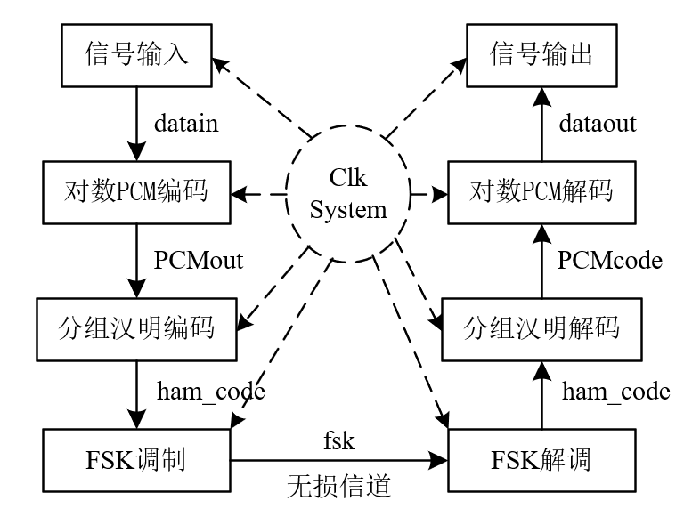

## 三、各部分的具体实现方法

### **1、Top——主连接模块**

#### 模块功能：

将下述各个小模块按照系统设计框图连接起来

#### 实现原理：

-   FreDivisions和Multi\_fredivision为两个分频模块
-   create\_data为信号产生模块
-   PCM\_encode为PCM编码模块
-   Ham\_encode为hamming编码模块
-   FSK\_modulate为FSK调制模块
-   FSK\_demodulate为FSK解调模块
-   Ham\_decode为hamming解码模块
-   PCM\_decode为PCM解码模块

### **2、FreDivisions——分频模块**

#### 模块功能：

将125MHz的晶振分频为31.25Hz作为驱动主频率clkIn

#### 实现原理：

使用了一个名为counterclkout的计数器变量，它的取值范围是2位二进制数。当计数器的值为01时，表示已经计数到2，此时将计数器重置为00，并将输出时钟信号clkout取反

```verilog
always @(posedge reset or posedge clk)
begin
    if(reset) begin
    counterclkout <= 0;
    end
    else begin
        if(counterclkout == 1) begin
            counterclkout <= 0;
      temp <= ~temp;
        end
        else begin
            counterclkout<=counterclkout+1;
        end
    end
end
endmodule
```

### **3、Multi\_fredivision——分频模块**

#### 模块功能：

-   将clkIn 2分频得到FSK\_clk，用于控制FSK信道的信号传输
-   将clkIn 32分频得到clk\_bitTransferRate，作为控制每个bit传输的时钟
-   将clkIn 32x14=448分频得到clk\_character\_rate，作为控制每个Byte传输的时钟

#### 实现原理：

```verilog
module Multi_fredivision(
    input clkIn,
    input reset,
    output reg clk_serialAD, //字符速率
    output reg clk2,
    output reg [3:0] counter2,
    output reg clkforAD,
    output reg [4:0] counter_serialAD, //32fre
    output reg [8:0] counterforAD,
    output reg clkAD, //448fre
    output reg [7:0] counterAD //比特速率
);

always @(posedge clkIn or posedge reset)
begin
    if (reset) begin
        clk_serialAD <= 1'b0;
        clk2 <= 1'b0;
        counter2 <= 4'b0;
        clkforAD <= 1'b0;
        counter_serialAD <= 5'b0;
        counterforAD <= 9'b0;
        counterAD <= 8'b0;
    end
    else begin
        if (clkIn) begin
            clk2 <= ~clk2; // 2分频得到约15.625MHz的clk2
            
            if (counter_serialAD == 4'b1111) begin // 32分频得到约976.6kHz的clk_serialAD
                counter_serialAD <= 5'b0;
                clk_serialAD <= ~clk_serialAD;
            end
            else begin
                counter_serialAD <= counter_serialAD + 1;
            end

            if (counterAD == 8'd223) begin // 32*14=448分频得到约69.75kHz的clkAD
                counterAD <= 8'b0;
                clkAD <= ~clkAD;
            end
            else begin
                counterAD <= counterAD + 1;
            end

            if (counterforAD == 9'b10111) begin // 48分频得到651kHz的AD时钟信号
                counterforAD <= 9'b0;
                clkforAD <= ~clkforAD;
            end
            else begin
                counterforAD <= counterforAD + 1;
            end
        end
    end
end

endmodule
```

### **4、create\_data——信号产生模块**

#### 模块功能：

产生用于传输的8bit信号，共1 Byte

#### 实现原理：

```verilog
module create_data(
    input clk_character_rate,
    input reset,
    output reg [7:0] datain
);

always @(posedge clk_character_rate or posedge reset)
begin
    if (reset) begin
        datain <= 8'b0; 
    end
    else begin
        datain <= 8'b00010101;
    end
end

endmodule
```

### **5、PCM\_encode——PCM编码模块**

#### 模块功能：

读入8bit均匀量化数据，产生13bit线性PCM

#### 实现原理：

```verilog
always @(posedge clk_character_rate or posedge reset)
begin
    if (reset) begin
        readytopcm <= 13'b0; 
        PCMout <= 8'b0;
    end
    else begin
        readytopcm[12:5] <= datain[7:0]; 
        readytopcm[4:0] <= 5'b00000; 
    end
end
```

再根据线性PCM～对数PCM转换表，得到8bit对数PCM编码

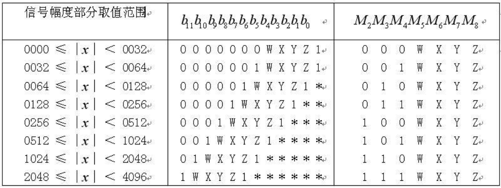

```verilog
always @(*)
begin
    if(readytopcm[11:5] == 7'b0000000) begin
        PCMout <= {readytopcm[12], 3'b000, readytopcm[4:1]};
    end
    if(readytopcm[11:5] == 7'b0000001) begin
        PCMout <= {readytopcm[12], 3'b001, readytopcm[4:1]};
    end
    if(readytopcm[11:6] == 6'b000001) begin
        PCMout <= {readytopcm[12], 3'b010, readytopcm[5:2]};
    end
    if(readytopcm[11:7] == 5'b00001) begin
        PCMout <= {readytopcm[12], 3'b011, readytopcm[6:3]};
    end
    if(readytopcm[11:8] == 4'b0001) begin
        PCMout <= {readytopcm[12], 3'b100, readytopcm[7:4]};
    end
    if(readytopcm[11:9] == 3'b001) begin
        PCMout <= {readytopcm[12], 3'b101, readytopcm[8:5]};
    end
    if(readytopcm[11:10] == 2'b01) begin
        PCMout <= {readytopcm[12], 3'b110, readytopcm[9:6]};
    end
    if(readytopcm[11] == 1'b1) begin
        PCMout <= {readytopcm[12], 3'b111, readytopcm[10:7]};
    end
end
```

### **6、Ham\_encode——hamming编码模块**

#### 模块功能：

将8bit对数PCM编码用两个（7，4）hamming编码转换为14bit hamming码

#### 实现原理：

（7，4）hamming编码所用G矩阵如下：

$$
\mathbf{G}=\left[\mathbf{I} ; \tilde{\mathbf{H}}^{T}\right]=\left[\begin{array}{ccccccc}1 & 0 & 0 & 0 & 1 & 1 & 1 \\ 0 & 1 & 0 & 0 & 1 & 1 & 0 \\ 0 & 0 & 1 & 0 & 1 & 0 & 1 \\ 0 & 0 & 0 & 1 & 0 & 1 & 1\end{array}\right]
$$

```verilog
always @(*)
begin
    ham_code[6:3] <= PCMcode[3:0];
    ham_code[2] <= PCMcode[1]^PCMcode[2]^PCMcode[3];
    ham_code[1] <= PCMcode[0]^PCMcode[2]^PCMcode[3];
    ham_code[0] <= PCMcode[1]^PCMcode[0]^PCMcode[3];
    
    ham_code[13:10] <= PCMcode[7:4];
    ham_code[9] <= PCMcode[5]^PCMcode[6]^PCMcode[7];
    ham_code[8] <= PCMcode[4]^PCMcode[6]^PCMcode[7];
    ham_code[7] <= PCMcode[5]^PCMcode[4]^PCMcode[7];
end
```

### **7、FSK\_modulate——FSK调制模块**

#### 模块功能：

将14bit hamming码依次进行FSK调制，每个bit占用16个FSK\_clk时钟周期

#### 实现原理：

在每个上升沿（posedge）的FSK\_clk信号上，根据输入比特信号，改变输出信号（FSK）的频率：当输入比特为 ‘1’ 时，输出信号的频率是 FSK\_clk 的一半；当输入比特为 ‘0’ 时，输出信号的频率是 FSK\_clk 的 1/4。输出信号的频率改变后，在上升沿（posedge）之间维持 16 个FSK\_clk 时钟周期，即计数器（counter）值为 15

```verilog
always @(posedge clk2 or posedge reset)
begin
    if (reset) begin
        counter <= 4'b0;
        clk_send <= 1'b0;
        i <= 4'b0;
        count <= 4'b0;
    end
    else begin
        if (counter == 4'b1111) begin  //1bit的持续周期数(16个clk2)
            counter <= 4'b0;
            if (i == 4'd13) begin
                i <= 4'b0;
            end
            else begin
                i <= i + 1;
            end
        end
        else begin
            counter <= counter + 1;
        end
        if (Hamcode[i] == 1'b1) begin
            clk_send <= ~clk_send;
        end
        else begin
            if (count == 1'b0) begin
                count <= 1'b1;
                clk_send <= ~clk_send;
            end
            else begin
                count <= 1'b0;
            end
        end
    end
end

assign fsk = clk_send; // FSK 调制后的信号输出
```

### **8、信道**

#### 模块功能：

设置为无损信道

### **9、FSK\_demodulate——FSK解调模块**

#### 模块功能：

将接收到的FSK信号依次解调为14bit的hamming码

#### 实现原理：

-   三个计数器变量：serialSignalCount\_ctr （负责计算接收到的串行信号的数目），
-   serialConversion\_flag （在clk\_serialAD的低电平时打开串并转换，在高电平时关闭串并转换，保证在一个clk\_receive的周期内只有一次的输出），
-   pulseCount\_ctr （用于计算收到的脉冲的数目，用以后面的判断来决定收到的是0还是1）

```verilog
always @(posedge fsk_signal or posedge reset)
begin
    if (reset) begin
        serialSignalCount_ctr <= 4'd13;
        serialConversion_flag <= 1'b0;
        pulseCount_ctr <= 3'b000;
    end
    else begin
        if (clk_bitTransferRate) begin 
            // serialConversion_flag = 1
            if (serialConversion_flag) begin
                // 接收的FSK信号共存储了14bit信息，接收完停止接收
                if (serialSignalCount_ctr == 4'd13) begin
                    serialSignalCount_ctr <= 4'd0;
                end
                // 继续接收下个信号
                else begin
                    serialSignalCount_ctr <= serialSignalCount_ctr + 1;
                end
            end
            // 统计接收到的脉冲
            pulseCount_ctr <= pulseCount_ctr + 1;
            serialConversion_flag <= 1'b0;
        end
        else begin // 当clk_bitTransferRate
            if (pulseCount_ctr > 3) begin
                if (!serialConversion_flag) begin
                    dataout_recoding[serialSignalCount_ctr] <= 1'b1; 
                    serialConversion_flag <= 1'b1; // 如果收到的过零数大于4就判断为收到的是1信号
                end
            end
            else begin
                if (!serialConversion_flag) begin
                    dataout_recoding[serialSignalCount_ctr] <= 1'b0; // 如果收到的过零数小于4就判断为收到的是信号
                    serialConversion_flag <= 1'b1;
                end
            end
            pulseCount_ctr <= 3'b000;
        end
        // the component for recoding
        if (serialSignalCount_ctr == 4'd0) begin // 14bit信号全部接收完时输出
            Hamcode <= dataout_recoding[13:0]; 
        end
    end
end
```

### **10、Ham\_decode——hamming解码模块**

#### 模块功能：

两个（7，4）hamming编码组成的14bit(位) hamming码解码为8bit(位)对数PCM码，同时具备1位纠错的功能

#### 实现原理：

用于hamming解码的H矩阵如下：

$$
\mathbf{H}=\left[\begin{array}{lllllll}1 & 1 & 1 & 0 & 1 & 0 & 0 \\ 1 & 1 & 0 & 1 & 0 & 1 & 0 \\ 1 & 0 & 1 & 1 & 0 & 0 & 1\end{array}\right]
$$

```verilog
always @(*)
begin
    s1[2] <= ham_code[6]^ham_code[5]^ham_code[4]^ham_code[2];
    s1[1] <= ham_code[6]^ham_code[5]^ham_code[3]^ham_code[1];
    s1[0] <= ham_code[6]^ham_code[4]^ham_code[3]^ham_code[0];

    s2[2] <= ham_code[13]^ham_code[12]^ham_code[11]^ham_code[9];
    s2[1] <= ham_code[13]^ham_code[12]^ham_code[10]^ham_code[8];
    s2[0] <= ham_code[13]^ham_code[11]^ham_code[10]^ham_code[7];

    // 纠一位错
    if (s1 == 3'b111) begin
        PCMcode[3:0] <= {~ham_code[6],ham_code[5:3]};
    end
    if (s1 == 3'b110) begin
        PCMcode[3:0] <= {ham_code[6],~ham_code[5],ham_code[4:3]};
    end
    if (s1 == 3'b101) begin
        PCMcode[3:0] <= {ham_code[6:5],~ham_code[4],ham_code[3]};
    end
    if (s1 == 3'b011) begin
        PCMcode[3:0] <= {ham_code[6:4],~ham_code[3]};
    end

    if (s2 == 3'b111) begin
        PCMcode[7:4] <= {~ham_code[13],ham_code[12:10]};
    end
    if (s2 == 3'b110) begin
        PCMcode[7:4] <= {ham_code[13],~ham_code[12],ham_code[11:10]};
    end
    if (s2 == 3'b101) begin
        PCMcode[7:4] <= {ham_code[13:12],~ham_code[11],ham_code[10]};
    end
    if (s2 == 3'b011) begin
        PCMcode[7:4] <= {ham_code[13:11],~ham_code[10]};
    end

    // 无错
    if (s1 == 3'b000|| s1 == 3'b001|| s1 == 3'b010 || s1 == 3'b100) begin
        PCMcode[3:0] <= {ham_code[6:3]};
    end
    if (s2 == 3'b000|| s2 == 3'b001|| s2 == 3'b010 || s2 == 3'b100) begin
        PCMcode[7:4] <= {ham_code[13:10]};
    end

end
```

### **11、PCM\_decode——PCM解码模块**

#### 模块功能：

根据线性PCM～对数PCM转换表，从8bit对数PCM码得到13bit线性PCM编码，再将线性PCM的高8位提取出来作为最终传输结果

#### 实现原理：

```verilog
always @(*)
begin
    linearoutput[12] <= datain[7];
    
    case (datain[6:4])
        3'b000:
            begin
                linearoutput[11:5] <= 7'b0000000;
                linearoutput[4:1] <= datain[3:0];
                linearoutput[0] <= 1'b1;
            end
        3'b001:
            begin
                linearoutput[11:5] <= 7'b0000001;
                linearoutput[4:1] <= datain[3:0];
                linearoutput[0] <= 1'b1;
            end
        3'b010:
            begin
                linearoutput[11:6] <= 6'b000001;
                linearoutput[5:2] <= datain[3:0];
                linearoutput[1:0] <= 2'b10;
            end
        3'b011:
            begin
                linearoutput[11:7] <= 5'b00001;
                linearoutput[6:3] <= datain[3:0];
                linearoutput[2:0] <= 3'b100;
            end
        3'b100:
            begin
                linearoutput[11:8] <= 4'b0001;
                linearoutput[7:4] <= datain[3:0];
                linearoutput[3:0] <= 4'b1000;
            end
        3'b101:
            begin
                linearoutput[11:9] <= 3'b001;
                linearoutput[8:5] <= datain[3:0];
                linearoutput[4:0] <= 5'b10000;
            end
        3'b110:
            begin
                linearoutput[11:10] <= 2'b01;
                linearoutput[9:6] <= datain[3:0];
                linearoutput[5:0] <= 6'b100000;
            end
        3'b111:
            begin
                linearoutput[11] <= 1'b1;
                linearoutput[10:7] <= datain[3:0];
                linearoutput[6:0] <= 7'b1000000;
            end
        default: 
                begin
                linearoutput[11] <= 1'b1;
                linearoutput[10:7] <= datain[3:0];
                linearoutput[6:0] <= 7'b1000000;
            end
    endcase
end

assign PCMout[7:0] = linearoutput[12:5];
```

## 四、实验结果及分析

### 1、实验仿真

实验使用verilog语言在vivado软件中进行仿真

#### **代码模块**

根据“具体实验方法”，对各个模块进行封装，文件目录如下：

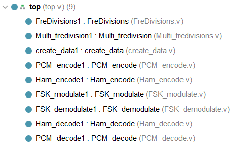

#### **仿真结果**

为了验证该系统的准确性，将输入信号datain设置为00010101，观察各个模块的输出及波形图

-   信号输入：datain (理论结果：00010101)

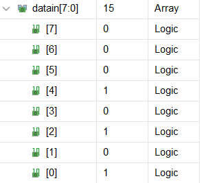

-   对数PCM编码：PCMout (理论结果：01010101)

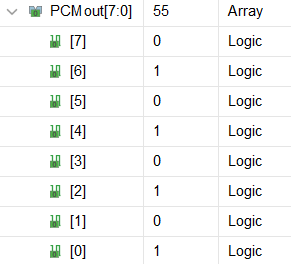

-   汉明分组编码：ham\_code (理论结果：01011010101101)，ham\_code由2个(7, 4)汉明码组成

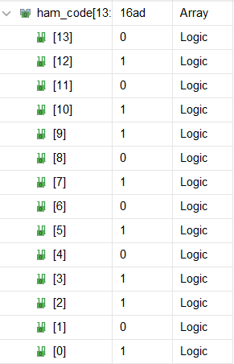

-   FSK调制：串行输出汉明码01011010101101

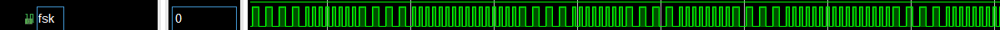

&#x20;                                                     0        1         0         1        1        0         1         0         1        0         1         1        0        1

-   FSK解调：ham\_code (理论结果：01011010101101)

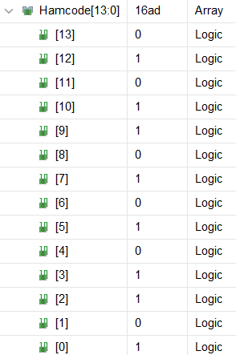

-   汉明分组解码：PCMcode (理论结果：01010101)

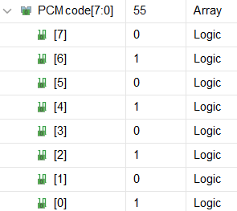

-   对数PCM解码：dataout (理论结果：00010101)

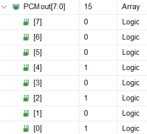

> 🤖仿真结果显示，该系统可以实现所有预期功能

### 2、烧录测试

在实验室，我们将上述代码烧录到了FPGA板中，并提前设定好输入(00010101)，按下reset数秒后，我们得到了该通信系统接收到的信号输出：

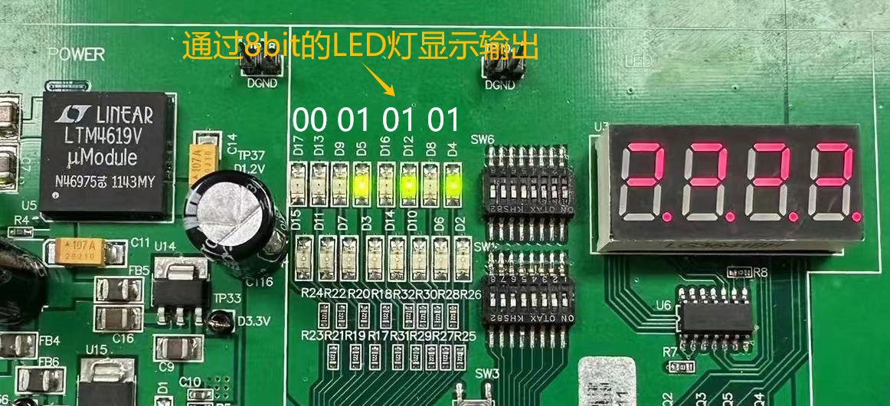

实验系统的接收结果与我们设定的输入相同，说明该系统成功实现了**基于PCM和Hamming编码的FSK调制通信系统**

## 五、小组分工

| **小组成员** | **成员分工**                               |
| -------- | -------------------------------------- |
| **李铠峰**  | 框架搭建、汉明码编解码、FSK调制、PCM码代码编写、实验仿真、实验报告撰写 |
| **袁振钊**  | 汉明码编解码、FSK调制、PCM码代码编写、烧录测试、实验报告撰写      |
| **王治**   | 框架搭建、FSK解调、PCM码解代码编写、烧录测试、实验报告总结       |

## 六、总结

本次实验取得了良好的进展，提前一周左右就成功完成了。我们首先开始进行了一个跑马灯的示例，通过这个例子逐渐学会了如何使用该板子。随后，我们迅速确定了选题并开始分工。我们将整个实验划分为几个模块，并在明确了代码逻辑和规范后，三个人分别负责不同的模块开发。同时，我们采用了Git进行工程管理，以便更好地协同合作。

在编写代码后，我们进行了Vivado仿真调试。虽然一开始的结果不尽如人意，但我们仔细分析并逐步追踪问题的源头，最终找到了问题所在并进行了解决。在这个过程中，我们深入理解和掌握了Verilog语言。

最后，我们只用了一次实验的时间就成功完成了Sim2Real实验。这可能得益于我们之前仿真结果的准确性，再加上对该板子的熟练掌握，我们迅速将其应用到实际管脚上，并进一步调试，最终获得了我们期望的结果。

最后，我们要感谢助教和老师的帮助。我们在实验过程中遇到了许多问题，他们都耐心地解答了我们的疑问，为我们提供了宝贵的指导和支持。非常感谢他们！
